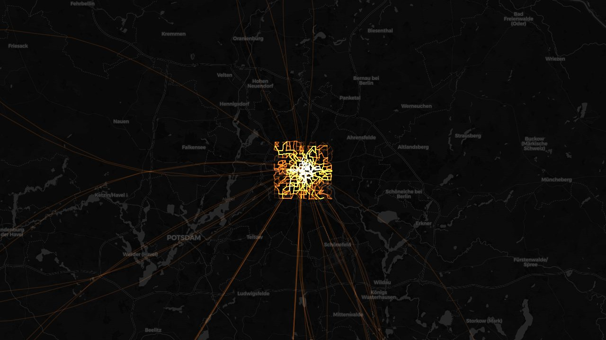

# Google Timeline Heatmap

Turn your Google location history into a Strava-style heatmap of everywhere you have been.

### ▶ [Open it here](https://jakielap.github.io/Google-Timeline-Heatmap/)

**Your data never leaves your browser.** There is no server, no account, no sign-up and no
analytics — the file you pick is read and drawn locally, on your own machine.

*The screenshot uses the built-in example data, not anyone's real history.*

---

## Try it without uploading anything

Open [the live page](https://jakielap.github.io/Google-Timeline-Heatmap/) and press
**“No file yet? See an example”**. You get a full, generated data set —
a home city, daily commutes, trips across Europe and a couple of flights — so you can click
through every feature before deciding whether to load your own history.

## What you get

- **Heatmap mode** — overlapping trips glow brighter, so your daily routes burn a bright path
  through the map and the one-off detours stay faint.
- **Uniform lines mode** — every trip drawn with the same weight on a light basemap. This one
  shows *reach* rather than frequency.
- **Filter by date and by transport** — a slider for the period, checkboxes for car, walking,
  cycling, public transport and flights.
- **Timelapse** — watch the trace grow day by day across the selected range.
- **Records and stats** — total distance, trips, active days, longest streak, busiest month,
  longest single journey, furthest points in each direction, centre of gravity.
- **Visited countries** — a list with the area you covered in each, click one to zoom to it.
- **Charts** — kilometres per month or per year (click a bar to isolate that period on the map),
  and a grid showing which days and hours you actually move.
- **Save a PNG** of the current view, at twice the screen resolution.
- **English and Polish**, switchable without reloading.

## Getting your data

The app reads the export straight from Google — no conversion needed. It detects the format
on its own.

**Android** — Settings → Location → Location services → Timeline → *Export Timeline data*.

**iPhone** — Google Maps app → your profile picture → Settings → Location & Privacy →
*Export Timeline data* → Save to Files. The file is called `location-history.json`.

**An older Google Takeout archive** works too — drop in the whole `.zip`, or the individual
`Records.json` / *Semantic Location History* files.

> Google moved Timeline onto the phone, so recent Takeout exports usually no longer contain it.
> The phone export is the way to go. Menu names get renamed from time to time — look for
> something like *Export Timeline data*.

A file of tens of megabytes is completely normal. If your export arrives as `.csv` (this happens
in some EU countries) the app cannot read it — it handles JSON only, and will tell you so
instead of failing silently.

## Using it

1. Open the page.
2. Drag your `.json` or `.zip` onto the drop zone, or click to pick it.
3. Wait a moment — a large export is parsed in a background thread, so the page stays responsive.
4. Pan and zoom. Adjust colour, brightness and line width to taste.

Nothing is written to disk unless you tick **“Remember data in this browser.”** It is off by
default, and turning it back off deletes whatever was already stored.

## Privacy, stated plainly

- Your location history is parsed and drawn entirely in the browser. It is never uploaded.
- The page does fetch a few things from the internet: the map library, ZIP support, country
  borders and map tiles.
- **Map tiles load as you pan, so the tile provider (CARTO) can see which area you are looking
  at.** It cannot see your trips or your file. Choosing the “No map” basemap stops even that.
- No cookies, no accounts, no tracking.

## Running and hosting it

It is a single HTML file with no build step and no backend.

- **Locally** — download `index.html` and open it in a browser.
- **Hosting it for others** — put `index.html` on any static host. This copy runs on GitHub
  Pages, served straight from the `main` branch with no build step.

An internet connection is needed for the map tiles and the two libraries loaded from a CDN.

## Supported formats

| Source | File |
| --- | --- |
| Phone export (current) | `Timeline.json`, `location-history.json`, `semanticSegments`, `rawSignals` |
| Takeout — raw records | `Records.json` (`locations` with `latitudeE7`/`longitudeE7`) |
| Takeout — Semantic Location History | `timelineObjects` (activity segments and place visits) |
| Takeout — Timeline Edits | `timelineEdits` |

Load several files at once and they add up, which is what you want when Takeout splits an
archive into a folder full of monthly files.

## Notes on the internals

- One file, plain JavaScript, [Leaflet](https://leafletjs.com/) for the map and
  [JSZip](https://stuk.github.io/jszip/) for archives.
- The trace is drawn on a custom canvas layer with additive blending — that is where the glow
  comes from.
- Parsing runs in a Web Worker, so a large export does not freeze the tab. The worker source is
  assembled at runtime from the marked sections of the same script, so the parser exists in
  exactly one copy.
- Rendering is done in slices on an off-screen canvas and swapped in when finished, so a dense
  map never blocks the interface mid-draw.
- Google sometimes stores one journey twice: a detailed navigated track *and* a bare
  start-to-end segment that draws as a straight line across the map. Those duplicates are
  detected and hidden by default; trips recorded without navigation are left alone.

## Licence

[GNU Affero General Public License v3.0](LICENSE) — free to use, study, modify and share.

The one condition worth knowing: **if you run a modified version as a website, you have to
publish your source code under the same licence.** Ordinary use of this page puts no obligation
on you whatsoever — it applies to anyone who takes the code, changes it and serves it to others.

Copyright stays with the author, so a separate commercial licence can be arranged if the AGPL
does not suit your case.

### Third-party components

[Leaflet](https://leafletjs.com/) (BSD-2-Clause) and [JSZip](https://stuk.github.io/jszip/)
(MIT) are loaded from a CDN. Country borders come from
[Natural Earth](https://www.naturalearthdata.com/) (public domain). Map tiles are served by
[CARTO](https://carto.com/basemaps/) and [Esri](https://www.esri.com/), each under its own terms
— if you host this for a large audience, check their usage policies first.
